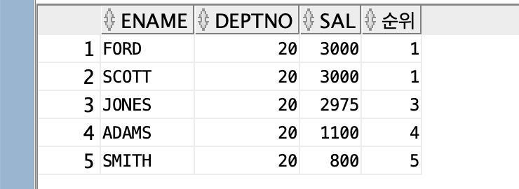
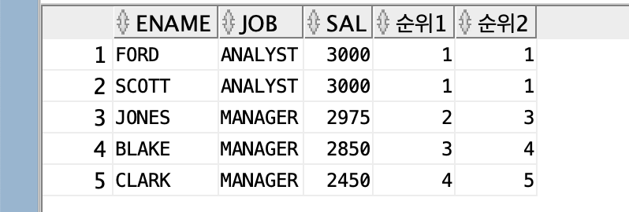

## rank()

>`rank() over(order by 컬럼명 desc)` : `over`뒤에 `rank()`를 적용할 수 있는 구문을 작성.
>									동일한 등수도 포함해서 순위를 매김.
>(`over()`에 괄호안에 있는 내용을 확장해서 순위를 출력해라. - `over` : '확장하다')

```sql
--직업이 ANALYST, MANAGER인 사원들의 이름, 직업, 월급과 월급에 대한 순위를 출력해라.
select ename, job, sal, 
	rank() over (order by sal desc) 순위 
--wherer 조건에 맞는 데이터 중 월급이 높은 순서대로 정렬해서 순위를 부여해라.
from emp where job in ('ANALYST', 'MANAGER');
```

```sql
--부서번호가 20인 직원의 이름과 직업, 급여와 순위를 출력해라
select ename, deptno, sal, rank() over (order by sal desc) 순위 from emp where deptno = 20;
```

⇒ 동일한 순위가 있을 경우 순위에 포함해서 매김(1등이 2명이여서 다음 등수는 2등이 아닌 3등으로 출력)

---
## dense_rank()

>`dense_rank() over (order by 컬럼명 desc)` :  동일한 등수를 순위에 포함시키지 않고 매김.
>`dense_rank() over(partition by 나눌 기준 컬럼 order by 컬럼) : 

```sql
select ename, job, sal, 
	dense_rank() over( order by sal desc) 순위1, 
	rank() over(order by sal desc) 순위2 
from emp where job in ('ANALYST', 'MANAGER');
```



